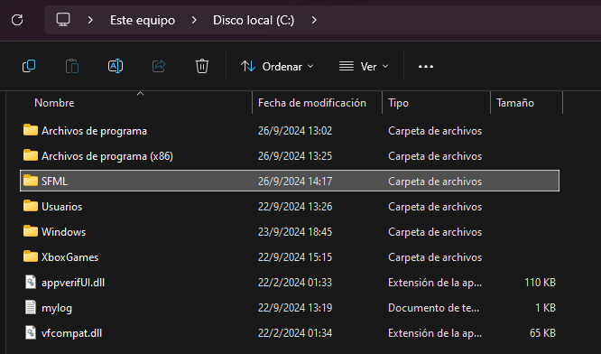
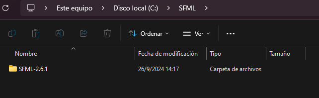

# SFML-Template 
# SFML 2.6.1
 

This template was created to easily install the SFML library in the Visual studio 2022 IDE 
# Installation guide

<a href="https://www.sfml-dev.org/files/SFML-2.6.1-windows-vc17-64-bit.zip" download>SFML 2.6.1 Visual C++ 17 (2022) - 64-bit</a>

<a href="https://www.sfml-dev.org/files/SFML-2.6.1-windows-vc17-32-bit.zip" download>SFML 2.6.1 Visual C++ 17 (2022) - 32-bit</a>

Once the SFML is downloaded unzip the SFML to drive C:
# Example.

next ->

# Once this is done we will proceed to install the template.

